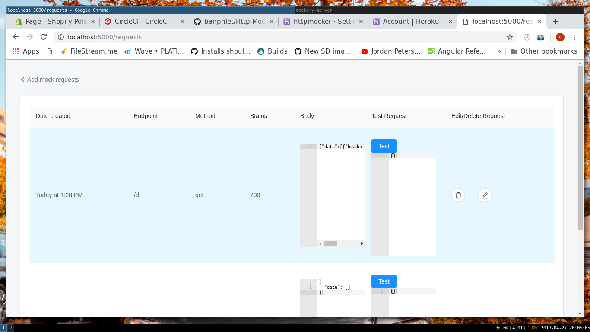

# Simple http mockey server build with nodejs and nextjs.


##  Start dev server 
```sh
> npm run dev

```


## Required envs

|   FIELD                   |          REQUIRED          |
| ------------------------- | -------------------------  |
|          DB_URL           |         YES                |
|   PORT                    |          YES               |
|  JWT_TOKEN                |           YES              |


### Preview

